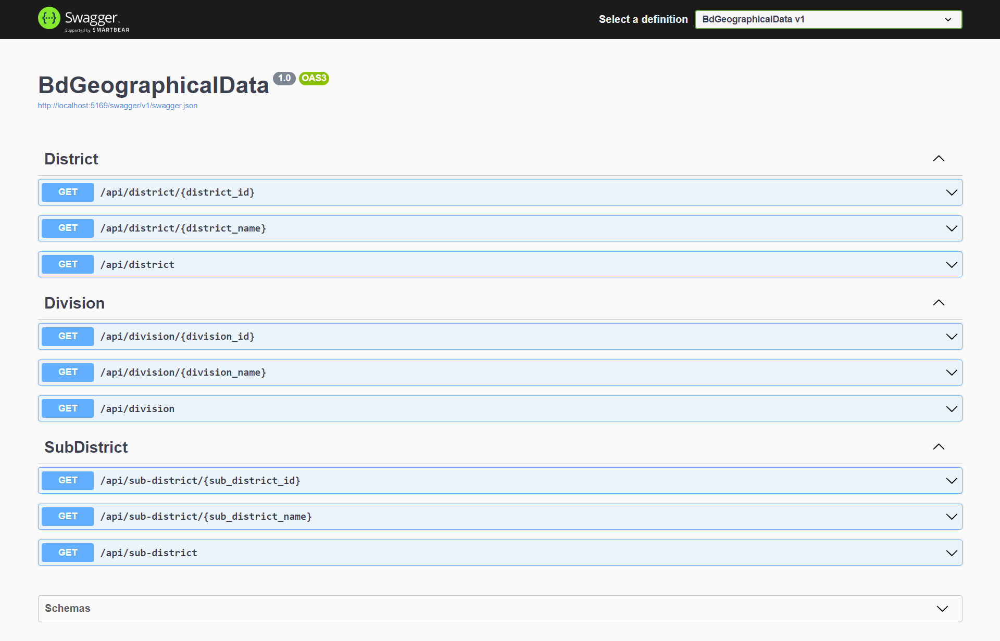

## Rationale

This API will provide Division, District, Sub-District related data of Bangladesh. The database is already provided as `app.db` with loaded data. Data examples:

- A Division and its Districts and Sub-Districts.
- A Districts and its Division and Sub-Districts.
- A Sub-District and its Division and District.



## Where to use

- Data provided by this API are frequently used in web applications where Geographical data is utilized.

## Why the API is read only?

- To enable `POST` or `PATCH` request, authentication needs to be added which will be too much opinionated.
- The database can be manipulated directly by SQL query or via separate API backend where proper authentication strategy is being used according to the business demand.

## How to run

- The preferred way to use the API is docker. However, you need dotnet 8 to run the source code.
- Precompiled binaries are also available in the release page. Just extract them and use.
- For API documentation, go to `/swagger` endpoint. Example url: `http://localhost:5000/swagger`
- If any package is missing, simply run:

```bash
dotnet restore
```

## Docker

- Docker file is added in the repo.
- Port `8080` is the exposed port for docker.
- For example, for Swagger documentation: [http://localhost:8080/swagger](http://localhost:8080/swagger)

## Environment variable

- Data can be loaded inside the application in Environment variable fashion through:

  - `appsetting.json` for generic data.
  - `appsettings.Development.json` this will be loaded when `ASPNETCORE_ENVIRONMENT ==  Development`
  - `appsettings.Production.json` this will be loaded when `ASPNETCORE_ENVIRONMENT ==  Production`
  - `secrets.json` for sensitive data.

- These files can accept any valid json value and they must be created in the parent directory (where `Program.cs` is located).

- Loading data from `secrets.json` is controlled by `"USE_SECRETS_JSON"`, it takes either `1` which means true or `-1` which means false.

## Response Cache

- Response Cache is enabled by default. The default cache time is 600 seconds (10 min) which can be changed through `RESPONSE_CACHE_DURATION_IN_SECOND`
- Note: Response Cache does not store any data in the server. It is all about how the client will cache the response so that it does not need to send the request again.

## Running from compiled binary

- If you want to run from single executable self-contained binary from the release page, port conflict may occur. To solve this issue, add the following lines in the existing json object of any of the files mentioned in [Environment variable](#environment-variable) to configure the port of kestrel server.

```json
  "Kestrel": {
    "Endpoints": {
      "HTTP": {
        "Url": "http://localhost:5169"
      }
    }
  }
```
